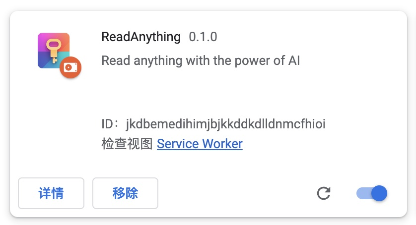

# ReadAnything —— 让读论文不再困难

Are you bothered by long and tedious papers filled with jargon? Are you frustrated by bad writing that seems to prevent you from understanding? Don't worry, let's harness the power of GPT to help us read anything!

冗长的句子、高深的词汇、故作玄虚的遣词，作者是不想我们读懂论文吗？如今，使用GPT，我们可以透过这些晦涩的表象，直达简单的本质——read anything!

# Install and setting 安装与设置

To download the latest version, click [here](https://github.com/Zhangyanbo/ReadAnything/releases), unzip the file, and follow the steps below to install the Chrome extension:

1. Type `chrome://extensions` in the address bar and press enter.
2. Enable developer mode by clicking the toggle switch located at the top right corner of the page.
3. Click on "Load unpacked" button and select the unzipped folder to install the extension.

点击[这里](https://github.com/Zhangyanbo/ReadAnything/releases)下载最新版本的插件，并解压，按如下步骤安装：

1. 在Chrome浏览器中键入`chrome://extensions`，进入拓展管理页面；
2. 开启右上角的「开发者模式」；
3. 点击「加载已解压的扩展程序」，打开刚刚解压的文件夹，完成安装；

To get started, follow the steps below:

1. Click the icon located at the top-right corner of the page.
2. Paste your OpenAI API key into the designated field.
3. Select the desired model - gpt-3.5-turbo or gpt-4 (if you have access).
4. Click "Save" to save your settings.
Congratulations, you're now ready to use the application!

然后需要设置API key：

1. 点击右上角的图标；
2. 将你的OpenAI API key粘贴到其中；
3. 点击Save保存；
4. 你还可以选择模型，包括gpt-3.5-turbo和gpt-4；

这样基本的设置就完成了

# Examples 使用案例

To begin, open a webpage of the paper you want to read, and select the content that you find hard to understand. Then, right-click and select "Explain".

首先，打开您想要阅读的论文网页，选择您觉得难以理解的内容。然后，右键单击“Explain”。

After a few seconds, you will find that the human-friendly version will show up on the top right!

稍等几秒，简化版的论文就出现在右上角了！

